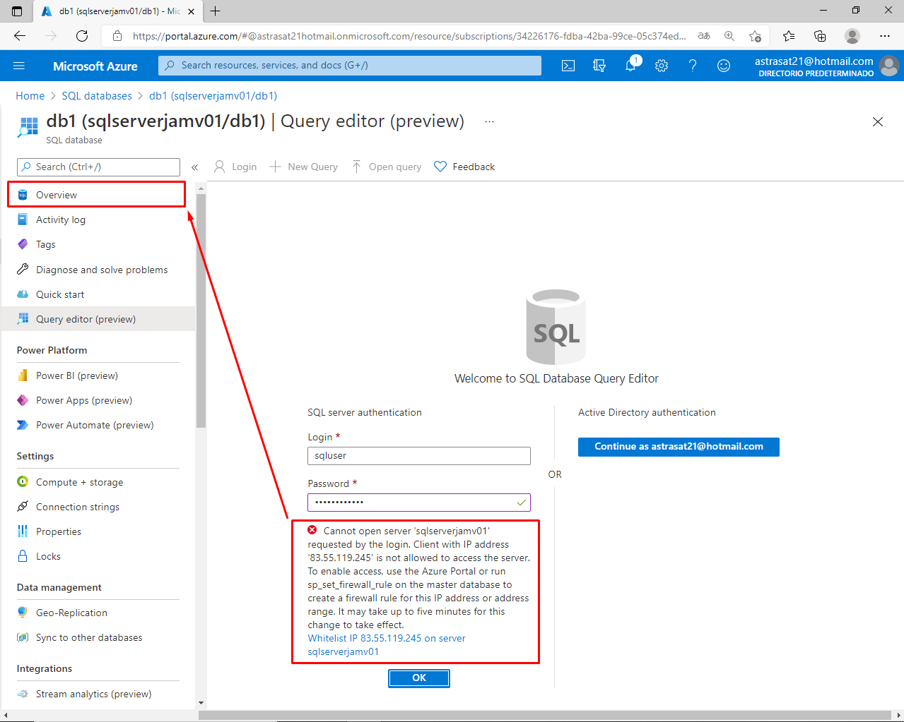

# 01 - Create a virtual machine in the portal

# 02 - Create a Web App

Valores de la telemetría tras la primera ejecución:

Valores de la telemetría después de la cuarta ejecución:

Valores de la telemetría después de la sexta ejecución:

Valores de la telemetría después de la novena ejecución:

Borrado del grupo de recursos:

#	03 - Deploy Azure Container Instances

Creación del Container Instance:

Ejecución del contenedor de instancia:

Final de la práctica: eliminación del grupo de recursos creado:

# 04 - Create a virtual network

# 05 - Create blob storage

Borrar el grupo de recursos creado:

# 06 - Create a SQL database

Borrado del grupo de recursos creado:

# 07 - Implement an Azure IoT Hub

# 08 - Implement Azure Functions

# 09 - Create a VM with a Template

